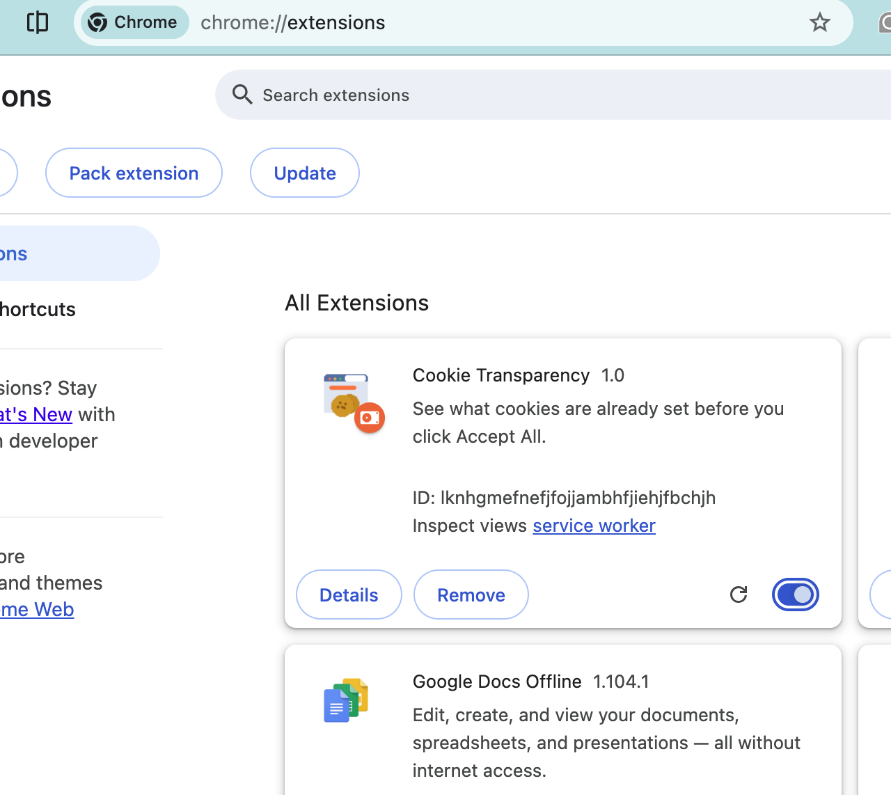
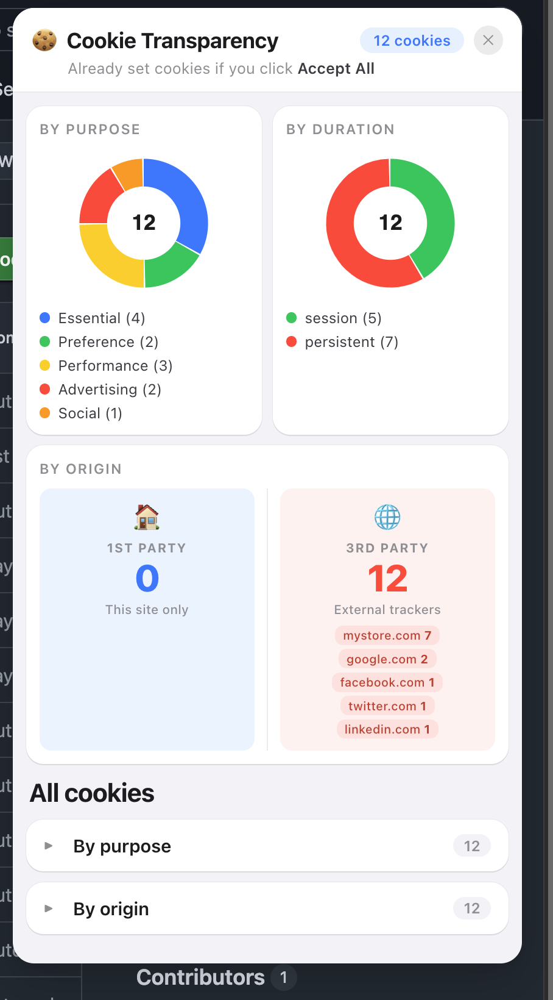

# 🍪 Cookie Transparency

A Chrome browser extension that shows you what cookies are already set on a website — **before you click Accept All**.

---

## Screenshots

| Popup View | Overlay on Page |
|:---:|:---:|
|  |  |

> 📁 Add your prototype images to an `images/` folder and rename them `screenshot-1.png` and `screenshot-2.png`

---

## What It Does

- **Auto-popup** — a panel slides in on every new website you visit, just like a cookie consent banner
- **Visualizes cookies** with donut charts broken down by purpose, duration, and origin
- **Risk-coded colors** — red for advertising trackers, green for essential cookies
- **Detailed cookie list** — grouped by purpose or origin, with info links for known trackers like `_fbp` and `_ga`
- **Non-intrusive** — dismiss with one click, won't re-appear on the same site

---

## File Structure

```
cookie-transparency/
├── manifest.json       — Extension config & permissions
├── background.js       — Detects new page navigations
├── content.js          — Injects the overlay panel into pages
├── overlay.css         — Styles for the in-page overlay
├── popup.html          — Toolbar popup UI
├── popup.js            — Popup logic & chart rendering
├── popup.css           — Popup styles
├── charts.js           — Donut chart drawing
├── cookies.js          — Simulated cookie data
└── icon{16,32,48,128}.png
```

---

## Installation

> Requires Google Chrome or any Chromium-based browser (Edge, Brave, etc.)

1. Download or clone this repository
2. Open Chrome and go to `chrome://extensions`
3. Enable **Developer mode** using the toggle in the top-right corner
4. Click **Load unpacked**
5. Select the `cookie-transparency/` folder
6. Pin the extension from the puzzle icon in the toolbar

That's it — navigate to any website and the panel will appear automatically.

---

## How It Works

```
New website visited
       ↓
background.js detects navigation (chrome.tabs.onUpdated)
       ↓
Sends message → content.js
       ↓
Overlay panel injected into page via Shadow DOM
       ↓
Simulated cookie data visualized with charts
```

The overlay runs inside a **Shadow DOM** so it never conflicts with the page's own styles.

---

## Compatibility

| Browser | Status |
|---|---|
| Chrome (Windows) | ✅ |
| Chrome (macOS) | ✅ |
| Edge (Chromium) | ✅ |
| Firefox | ❌ Not supported |
| Safari | ❌ Not supported |

---

## Note on Cookie Data

This prototype uses **simulated cookie data** for demonstration purposes. The 12 cookies shown (session_id, _ga, _fbp, etc.) represent a realistic set of what a typical e-commerce site sets. Real cookie detection can be enabled by swapping the mock data in `cookies.js` with a live `chrome.cookies.getAll()` call.

---

## Built With

- Vanilla JavaScript — no frameworks
- HTML & CSS (Shadow DOM for isolation)
- Chrome Extension Manifest V3
- Canvas API for donut charts

---

## License

MIT